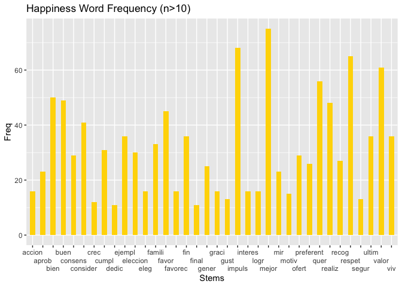
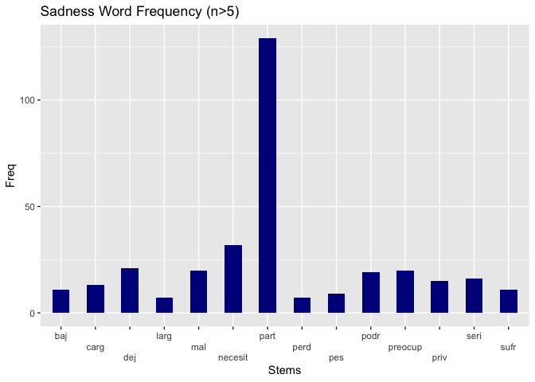
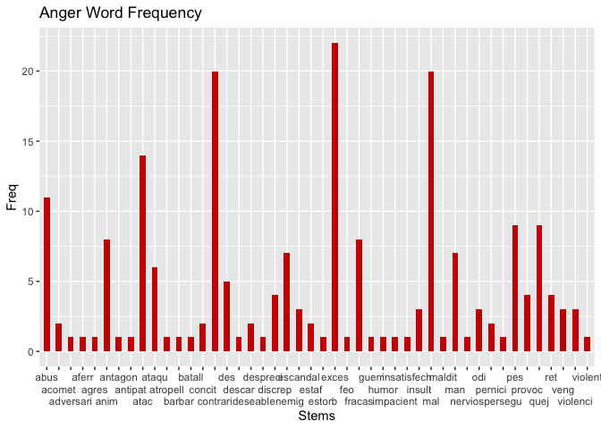
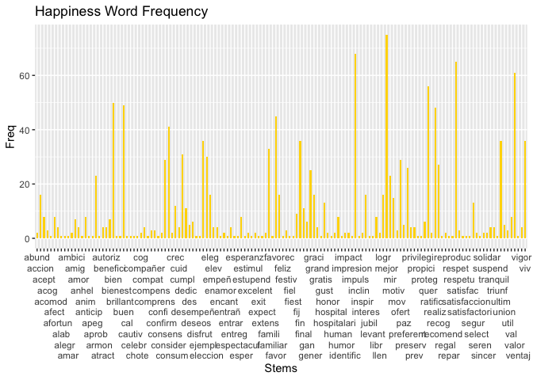
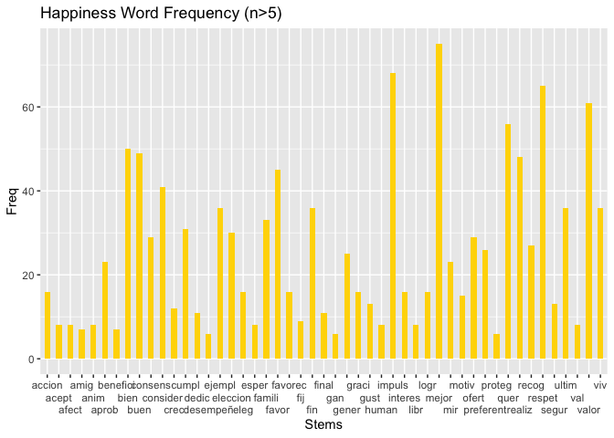
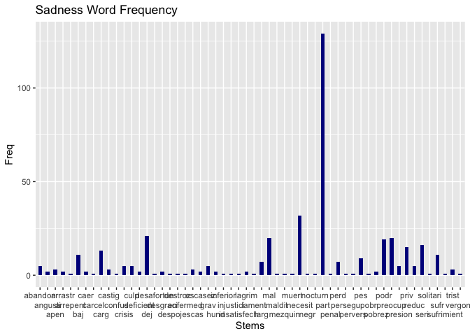
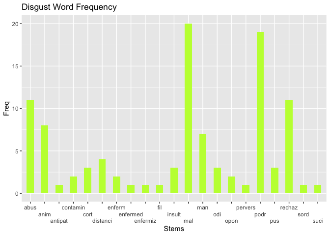
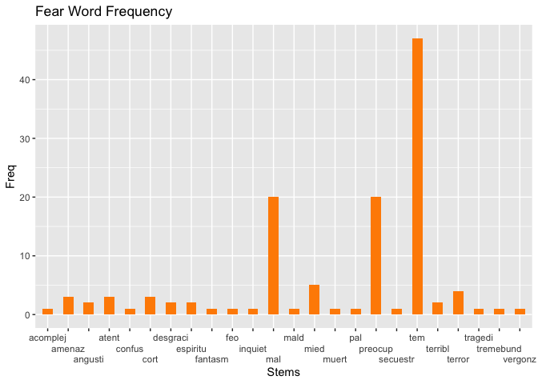
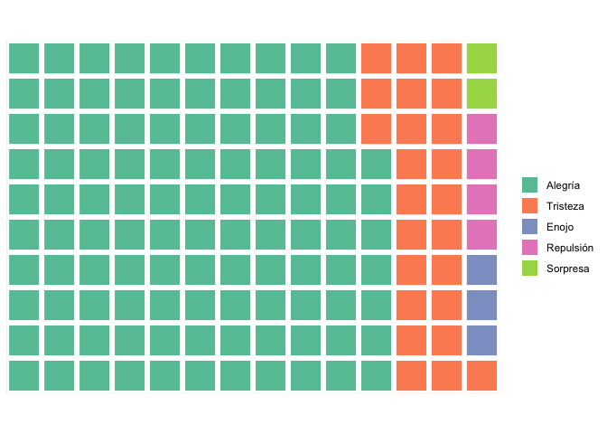

Progress-Report-1
================
Claire McLean
2024-10-28

NOTE: The dataset I am using for this project is named
basque_parliament_1 and was found on <https://huggingface.co>. The
original project was funded by the Spanish Ministry of Science and
Innovation, and is licensed as cc0-1.0. Citation: @misc
{software_technologies_working_group_2024, author = { {Software
Technologies Working Group} }, title = { basque_parliament_1 (Revision
a2fbcaf) }, year = 2024, url = {
<https://huggingface.co/datasets/gttsehu/basque_parliament_1> }, doi = {
10.57967/hf/2485 }, publisher = { Hugging Face } } \# Progress Report 1
\## Here, I will begin the next steps of my data cleaning. \## Step 1:
Performed in Python In this step, I wrote a script to filter the
train.tsv file provided in the Hugging Face dataset folder to include
only the rows/utterances that contain the following keywords:
\[‘hablante’, ‘euskera’, ‘lenguaje’, ‘idioma’, ‘aprendizaje’,
‘lingüístic’\] These keywords were chosen because they demonstrate the
relevance of the utterance to the concept of language, linguistics, or
“speaker”. The final output of the script was a smaller .csv file
containing only the rows that will be relevant to my analysis. This
dataframe will be further cleaned in later steps. This script has been
included in my Progress Report 1, but will most likely not be part of my
final submission.

## Step 2: Data Wrangling in R

First, import dependencies:

``` r
library("tidyverse")
```

    ## ── Attaching core tidyverse packages ──────────────────────── tidyverse 2.0.0 ──
    ## ✔ dplyr     1.1.4     ✔ readr     2.1.5
    ## ✔ forcats   1.0.0     ✔ stringr   1.5.1
    ## ✔ ggplot2   3.5.1     ✔ tibble    3.2.1
    ## ✔ lubridate 1.9.3     ✔ tidyr     1.3.1
    ## ✔ purrr     1.0.2     
    ## ── Conflicts ────────────────────────────────────────── tidyverse_conflicts() ──
    ## ✖ dplyr::filter() masks stats::filter()
    ## ✖ dplyr::lag()    masks stats::lag()
    ## ℹ Use the conflicted package (<http://conflicted.r-lib.org/>) to force all conflicts to become errors

``` r
library("readr")
library("tidytext")
library("dplyr")
```

## The following steps are the pipeline I followed to split the data into two smaller dataframes. This pipeline can be ignored.

Next, read in the .tsv file:

``` r
#raw_data <- read_tsv("train.tsv")
#raw_data
```

Finding number of total rows in the raw data:

``` r
#row_count <- nrow(raw_data)
#row_count
```

Now, breaking up the dataset into two separate parts so that it is
possible to push to GitHub (100MB maximum):

``` r
#row_split1 <- (nrow(raw_data)/2) %>% round(digits = 0)
#row_split2 <- row_split1+1
#raw_data1 <- raw_data %>%
  #slice(1:row_split)
#raw_data2 <- raw_data %>%
  #slice(row_split2:row_count)
```

Exporting the two above datasets into .csv files:

``` r
#write_csv(raw_data1, "raw_data1.csv")
#write_csv(raw_data2, "raw_data2.csv")
```

## This is where I uploaded the two smaller .csv files:

``` r
raw_data1 <- read_csv("raw_data1.csv")
```

    ## Rows: 374972 Columns: 6
    ## ── Column specification ────────────────────────────────────────────────────────
    ## Delimiter: ","
    ## chr (3): path, language, sentence
    ## dbl (3): speaker_id, PRR, length
    ## 
    ## ℹ Use `spec()` to retrieve the full column specification for this data.
    ## ℹ Specify the column types or set `show_col_types = FALSE` to quiet this message.

``` r
raw_data2 <- read_csv("raw_data2.csv")
```

    ## Rows: 374973 Columns: 6
    ## ── Column specification ────────────────────────────────────────────────────────
    ## Delimiter: ","
    ## chr (3): path, language, sentence
    ## dbl (3): speaker_id, PRR, length
    ## 
    ## ℹ Use `spec()` to retrieve the full column specification for this data.
    ## ℹ Specify the column types or set `show_col_types = FALSE` to quiet this message.

Combining the two dataframes using rbind():

``` r
raw_data <- rbind(raw_data1, raw_data2)
```

Viewing new, combined dataframe:

``` r
nrow(raw_data)
```

    ## [1] 749945

``` r
ncol(raw_data)
```

    ## [1] 6

Starting with 749,945 rows/utterances

Now, filtering to only include rows that are Spanish utterances (exclude
Basque and bilingual):

``` r
small_data_span <- raw_data %>% filter(language == "es")
nrow(small_data_span)
```

    ## [1] 524942

Now 524,942 rows/utterances (lost 225,021)

Using stringr to identify utterances/sentences that contain the
following keywords. \[‘hablante’, ‘euskera’, ‘lenguaje’, ‘idioma’,
‘aprendizaje’, ‘lingüístic’\]. This will allow me to perform sentiment
analysis only on the utterances that are related in some way to
language. Specifically, using str_detect() will allow me to identify
occurrences of both ‘hablante/es’, ‘lenguaje/es’, ‘lingüística/o/as/os’.
Further, I created another vector that is used to detect occurrences of
\[‘castellan’, ‘galleg’\], which detects both ‘castellano/a’ and
‘gallego/a’.

``` r
keywords_vec <- ('hablante|euskera|lenguaje|idioma|lingüístic')
keywords_vec1 <- ('castellan|galleg')
keywords_col <- small_data_span$sentence %>%
  str_detect(keywords_vec)

keywords_col2 <- small_data_span$sentence %>% 
  str_detect(keywords_vec1)

small_data_span2 <- small_data_span %>%
  mutate(keywords = keywords_col) %>% 
  mutate(non_keywords = keywords_col2)

small_data_span3 <- small_data_span2 %>%
  filter(keywords == TRUE) %>% 
  filter(non_keywords == FALSE)

nrow(small_data_span3)
```

    ## [1] 3209

Now 3209 rows (lost 521,715 rows)

Changing name of dataframe:

``` r
sampled_data <- small_data_span3
```

Now exporting dataframe to .csv file:

``` r
write_csv(sampled_data, "sampled_data.csv")
```

## Some basic stats:

``` r
#number of rows:
nrow(sampled_data)
```

    ## [1] 3209

``` r
#number of columns:
ncol(sampled_data)
```

    ## [1] 8

``` r
#average utterance length
mean(sampled_data$length)
```

    ## [1] 7.644313

``` r
#number of unique speakers
n_distinct(sampled_data$speaker_id)
```

    ## [1] 127

## Importing SEL lexicon

Load dependencies:

``` r
library("readxl")
library("readr")
```

Reading in Spanish Emotion Lexicon file:

``` r
sel <- read_excel("SEL.xlsx")
nrow(sel)
```

    ## [1] 2036

Starting with 2,036 emotion words in the SEL.

Viewed final plots and assessed which words carried less emotional
‘weight’. Removed these words from the dataframe as they do not
contribute much to the analysis. Additionally, created word stemmer to
isolate emotion words without gender suffix, as all gendered words in
the dataset are masculine:

``` r
library("SnowballC")

low_ew_vec <- ('cuent|solo|sola|llev|lleg|sab|dec|dich|ped|mano')
low_ew <- sel$Palabra %>% 
  str_detect(low_ew_vec)
low_ew2 <- sel %>% 
  mutate('LowEmotion' = low_ew)
sel2 <- sel %>% 
  filter(low_ew == FALSE)

stemmed_sel <- wordStem(sel2$Palabra, language = "spanish")
stemmed_sel <- sel2 %>% 
  mutate(Stems = stemmed_sel) %>% select('#', Stems, PFA, Categoría, -Palabra)
nrow(stemmed_sel)
```

    ## [1] 1988

``` r
#If stem occurs multiple times in same emotion, delete duplicates. If stem occurs multiple times across different emotions, keep duplicates:
stemmed_sel <- stemmed_sel %>% group_by(Categoría) %>% 
  distinct(Stems, .keep_all = TRUE)
nrow(stemmed_sel)
```

    ## [1] 1548

Now, 1,548 tokens in SEL (deleted all occurrences of words with low
emotional weight, and all duplicates of stems that occurred within the
same emotion)

Finding number of emotion words per emotion:

``` r
happiness <- stemmed_sel %>% 
  filter(Categoría=='Alegría') %>% 
  nrow()
anger <- stemmed_sel %>% 
  filter(Categoría=='Enojo') %>% 
  nrow()
fear <- stemmed_sel %>% 
  filter(Categoría=='Miedo') %>% 
  nrow()
disgust <- stemmed_sel %>% 
  filter(Categoría=='Repulsión') %>% 
  nrow()
surprise <- stemmed_sel %>% 
  filter(Categoría=='Sorpresa') %>% 
  nrow()
sadness <- stemmed_sel %>% 
  filter(Categoría=='Tristeza') %>% 
  nrow()
happiness
```

    ## [1] 511

``` r
anger
```

    ## [1] 289

``` r
fear
```

    ## [1] 161

``` r
disgust
```

    ## [1] 166

``` r
surprise
```

    ## [1] 128

``` r
sadness
```

    ## [1] 293

``` r
sel_distribution <- stemmed_sel %>%
  group_by(Categoría) %>% 
  mutate(Freq=n()) %>%
  select(Categoría, Freq) %>% 
  distinct()
sel_distribution
```

    ## # A tibble: 6 × 2
    ## # Groups:   Categoría [6]
    ##   Categoría  Freq
    ##   <chr>     <int>
    ## 1 Alegría     511
    ## 2 Enojo       289
    ## 3 Miedo       161
    ## 4 Repulsión   166
    ## 5 Sorpresa    128
    ## 6 Tristeza    293

Tokenizing sentences (ngrams):

``` r
library(dplyr)
library(tidytext)

sampled_data_ngrams <- sampled_data %>%
  unnest_tokens(tokens, sentence, token="words", drop=FALSE, to_lower=TRUE)
```

Stemming sentence tokens (ngrams):

``` r
token_stems <- wordStem(sampled_data_ngrams$tokens, language = "spanish")
stemmed_ngrams <- sampled_data_ngrams %>% 
  mutate(Stems = token_stems)
stemmed_ngrams
```

    ## # A tibble: 66,078 × 10
    ##    path   language speaker_id   PRR length sentence keywords non_keywords tokens
    ##    <chr>  <chr>         <dbl> <dbl>  <dbl> <chr>    <lgl>    <lgl>        <chr> 
    ##  1 10-00… es              370   100   6.06 con una… TRUE     FALSE        con   
    ##  2 10-00… es              370   100   6.06 con una… TRUE     FALSE        una   
    ##  3 10-00… es              370   100   6.06 con una… TRUE     FALSE        manip…
    ##  4 10-00… es              370   100   6.06 con una… TRUE     FALSE        absol…
    ##  5 10-00… es              370   100   6.06 con una… TRUE     FALSE        del   
    ##  6 10-00… es              370   100   6.06 con una… TRUE     FALSE        lengu…
    ##  7 10-00… es              370   100   6.06 con una… TRUE     FALSE        y     
    ##  8 10-00… es              370   100   6.06 con una… TRUE     FALSE        confi…
    ##  9 10-00… es              370   100   6.06 con una… TRUE     FALSE        una   
    ## 10 10-00… es              370   100   6.06 con una… TRUE     FALSE        frase 
    ## # ℹ 66,068 more rows
    ## # ℹ 1 more variable: Stems <chr>

``` r
nrow(stemmed_ngrams)
```

    ## [1] 66078

66,078 stems total (before inner-joining with SEL)

The following two code chunks were inspired by a project by Kayleah
Griffen, which can be found at the following site:
<https://rpubs.com/klgriffen96/data607_hw10>

Does word correspond to a particular emotion?

``` r
merged_data <- stemmed_ngrams %>% 
  inner_join(stemmed_sel, by="Stems", multiple = "all", unmatched = "drop", relationship = "many-to-many")

nrow(merged_data)
```

    ## [1] 2422

2842 stems after inner-joining with SEL (stems that did not have matches
in the SEL were dropped)

Grouping by sentence/utterance:

``` r
merged_data2 <- merged_data %>% 
  arrange(speaker_id, group_by=TRUE)
merged_data2
```

    ## # A tibble: 2,422 × 13
    ##    path   language speaker_id   PRR length sentence keywords non_keywords tokens
    ##    <chr>  <chr>         <dbl> <dbl>  <dbl> <chr>    <lgl>    <lgl>        <chr> 
    ##  1 10-04… es                0 100     9.57 porque … TRUE     FALSE        conse…
    ##  2 10-04… es                0 100     9.57 porque … TRUE     FALSE        graci…
    ##  3 10-07… es                0  99.2   9.21 y del p… TRUE     FALSE        recog…
    ##  4 10-07… es                0  99.2   9.21 y del p… TRUE     FALSE        lograr
    ##  5 10-08… es                0 100    10    y que q… TRUE     FALSE        prese…
    ##  6 10-08… es                0 100    10    y que q… TRUE     FALSE        elecc…
    ##  7 10-08… es                0 100    10    y que q… TRUE     FALSE        graci…
    ##  8 10-14… es                0  99.0   8.05 hemos c… TRUE     FALSE        favor 
    ##  9 10-16… es                0  90.8   9.06 esas pr… TRUE     FALSE        mejora
    ## 10 10-16… es                0  90.8   9.06 esas pr… TRUE     FALSE        graci…
    ## # ℹ 2,412 more rows
    ## # ℹ 4 more variables: Stems <chr>, `#` <dbl>, PFA <dbl>, Categoría <chr>

Creating wordclouds for each sentiment:

``` r
library(wordcloud)
```

    ## Loading required package: RColorBrewer

``` r
library(RColorBrewer)
library(wordcloud2)

#Ungrouping to create wordclouds
merged_data3 <- merged_data %>% 
  ungroup()
merged_data3
```

    ## # A tibble: 2,422 × 13
    ##    path   language speaker_id   PRR length sentence keywords non_keywords tokens
    ##    <chr>  <chr>         <dbl> <dbl>  <dbl> <chr>    <lgl>    <lgl>        <chr> 
    ##  1 10-00… es              370 100     6.06 con una… TRUE     FALSE        confi…
    ##  2 10-00… es              370 100     9.02 es en u… TRUE     FALSE        parti…
    ##  3 10-00… es                6 100     5.86 del gob… TRUE     FALSE        ataque
    ##  4 10-00… es                6 100     9.74 la rece… TRUE     FALSE        ataque
    ##  5 10-00… es              290 100     6.71 porque … TRUE     FALSE        respe…
    ##  6 10-00… es              290 100     4.13 decir q… TRUE     FALSE        ataque
    ##  7 10-00… es              290  98.8   6.17 derecho… TRUE     FALSE        elecc…
    ##  8 10-00… es              290 100    10.2  aspecto… TRUE     FALSE        graci…
    ##  9 10-00… es                6  94.3   5.04 disposi… TRUE     FALSE        bueno 
    ## 10 10-00… es                6 100     5.2  del tem… TRUE     FALSE        tema  
    ## # ℹ 2,412 more rows
    ## # ℹ 4 more variables: Stems <chr>, `#` <dbl>, PFA <dbl>, Categoría <chr>

Below, I am grouping each emotion and its corresponding tokens into an
object. In addition to grouping them, I also deleted duplicate stems
that would otherwise present problems in my analysis and kept only the
columns that prove to be necessary in plotting the data. I want to avoid
certain tokens being plotted multiple times if they are part of the same
word in the same utterance.

``` r
anger_words <- merged_data3 %>% 
  filter(Categoría=="Enojo") %>% 
  group_by(Stems) %>% 
  mutate(Freq = n()) %>% 
  ungroup() %>% 
  select(Stems, Freq, Categoría) %>% 
  distinct(Stems, .keep_all = TRUE)

happiness_words <- merged_data3 %>% 
  filter(Categoría=="Alegría") %>% 
  group_by(Stems) %>% 
  mutate(Freq = n()) %>% 
  ungroup() %>% 
  select(Stems, Freq, Categoría) %>% 
  distinct(Stems, .keep_all = TRUE)

sadness_words <- merged_data3 %>% 
  filter(Categoría=="Tristeza") %>% 
  group_by(Stems) %>% 
  mutate(Freq = n()) %>% 
  ungroup() %>% 
  select(Stems, Freq, Categoría) %>% 
  distinct(Stems, .keep_all = TRUE)

surprise_words <- merged_data3 %>% 
  filter(Categoría=="Sorpresa") %>% 
  group_by(Stems) %>% 
  mutate(Freq = n()) %>% 
  ungroup() %>% 
  select(Stems, Freq, Categoría) %>% 
  distinct(Stems, .keep_all = TRUE)

disgust_words <- merged_data3 %>% 
  filter(Categoría=="Repulsión") %>% 
  group_by(Stems) %>% 
  mutate(Freq = n()) %>% 
  ungroup() %>% 
  select(Stems, Freq, Categoría) %>% 
  distinct(Stems, .keep_all = TRUE)

fear_words <- merged_data3 %>% 
  filter(Categoría=="Miedo") %>% 
  group_by(Stems) %>% 
  mutate(Freq = n()) %>% 
  ungroup() %>% 
  select(Stems, Freq, Categoría) %>% 
  distinct(Stems, .keep_all = TRUE)

anger_words
```

    ## # A tibble: 46 × 3
    ##    Stems     Freq Categoría
    ##    <chr>    <int> <chr>    
    ##  1 ataqu        6 Enojo    
    ##  2 exces       22 Enojo    
    ##  3 contrari    20 Enojo    
    ##  4 man          7 Enojo    
    ##  5 discrep      4 Enojo    
    ##  6 atac        14 Enojo    
    ##  7 provoc       4 Enojo    
    ##  8 acomet       2 Enojo    
    ##  9 batall       1 Enojo    
    ## 10 ret          4 Enojo    
    ## # ℹ 36 more rows

Generating wordclouds (1) for each sentiment:

``` r
#anger
set.seed(10)
wordcloud(words = anger_words$Stems, freq = anger_words$Freq, min.freq = 1,
          max.words=200, random.order=FALSE, rot.per=0.5, scale=c(3.5, 0.3),
          colors=brewer.pal(8, "Set1"))
```

<!-- -->

``` r
#happiness
set.seed(10)
wordcloud(words = happiness_words$Stems, freq = happiness_words$Freq, min.freq = 1,
          max.words=200, random.order=FALSE, rot.per=0.5, scale=c(2.5, 0.3),
          colors=brewer.pal(8, "Set1"))
```

<!-- -->

``` r
#sadness
set.seed(10)
wordcloud(words = sadness_words$Stems, freq = sadness_words$Freq, min.freq = 1,
          max.words=200, random.order=FALSE, rot.per=0.5, scale=c(3.5, 0.3),
          colors=brewer.pal(8, "Set1"))
```

<!-- -->

``` r
#surprise
set.seed(10)
wordcloud(words = surprise_words$Stems, freq = surprise_words$Freq, min.freq = 1,
          max.words=200, random.order=FALSE, rot.per=0.5, scale=c(3, 0.3),
          colors=brewer.pal(8, "Set1"))
```

<!-- -->

``` r
#disgust
set.seed(10)
wordcloud(words = disgust_words$Stems, freq = disgust_words$Freq, min.freq = 1,
          max.words=200, random.order=FALSE, rot.per=0.5, scale=c(3.5, 0.3),
          colors=brewer.pal(8, "Set1"))
```

<!-- -->

``` r
#fear
set.seed(8)
wordcloud(words = fear_words$Stems, freq = fear_words$Freq, min.freq = 1,
          max.words=200, random.order=FALSE, rot.per=0.5, scale=c(3.5, 0.3),
          colors=brewer.pal(8, "Set1"))
```

<!-- -->

Generating bar charts for each sentiment:

``` r
library(ggplot2)

anger_plot <- ggplot(anger_words, aes(Stems, Freq)) + 
  geom_bar(stat = 'identity', fill="red3", width = 0.5) +
  scale_x_discrete(guide = guide_axis(n.dodge=3)) +
  labs(title = 'Anger Word Frequency')
anger_plot
```

<!-- -->

``` r
happiness_plot1 <- ggplot(happiness_words, aes(Stems, Freq)) + 
  geom_bar(stat = 'identity', fill="gold1", width = 0.5) +
  scale_x_discrete(guide = guide_axis(n.dodge=10)) +
  labs(title = 'Happiness Word Frequency')
happiness_plot1
```

<!-- -->

``` r
happiness_words2 <- happiness_words %>% 
  filter(Freq > 5)
happiness_plot2 <- ggplot(happiness_words2, aes(Stems, Freq)) + 
  geom_bar(stat = 'identity', fill="gold1", width = 0.5) +
  scale_x_discrete(guide = guide_axis(n.dodge=3)) +
  labs(title = 'Happiness Word Frequency (n>5)')
happiness_plot2
```

<!-- -->

``` r
sadness_plot <- ggplot(sadness_words, aes(Stems, Freq)) + 
  geom_bar(stat = 'identity', fill="blue4", width = 0.5) +
  scale_x_discrete(guide = guide_axis(n.dodge=3)) +
  labs(title = 'Sadness Word Frequency')
sadness_plot
```

<!-- -->

``` r
surprise_plot <- ggplot(surprise_words, aes(Stems, Freq)) + 
  geom_bar(stat = 'identity', fill="mediumspringgreen", width = 0.5) +
  scale_x_discrete(guide = guide_axis(n.dodge=3)) +
  labs(title = 'Surprise Word Frequency')
surprise_plot
```

<!-- -->

``` r
disgust_plot <- ggplot(disgust_words, aes(Stems, Freq)) + 
  geom_bar(stat = 'identity', fill="olivedrab1", width = 0.5) +
  scale_x_discrete(guide = guide_axis(n.dodge=3)) +
  labs(title = 'Disgust Word Frequency')
disgust_plot
```

<!-- -->

``` r
fear_plot <- ggplot(fear_words, aes(Stems, Freq)) + 
  geom_bar(stat = 'identity', fill="darkorange", width = 0.5) +
  scale_x_discrete(guide = guide_axis(n.dodge=3)) +
  labs(title = 'Fear Word Frequency')
fear_plot
```

<!-- -->

Finding general sentiment for each speaker:

``` r
by_speaker <- merged_data3 %>% 
  count(speaker_id, Categoría, sort=TRUE) %>%
  filter(n == max(n), .by=speaker_id)
by_speaker
```

    ## # A tibble: 128 × 3
    ##    speaker_id Categoría     n
    ##         <dbl> <chr>     <int>
    ##  1        290 Alegría     240
    ##  2        353 Alegría      85
    ##  3        189 Alegría      81
    ##  4        355 Alegría      62
    ##  5        380 Alegría      62
    ##  6        128 Alegría      52
    ##  7        275 Alegría      51
    ##  8        463 Alegría      50
    ##  9        462 Alegría      46
    ## 10        530 Alegría      45
    ## # ℹ 118 more rows

``` r
by_speaker %>% distinct(speaker_id) %>% nrow()
```

    ## [1] 111

Plotting composition of general sentiments across speakers:

``` r
#Out of 122 general sentiments per speaker, find distribution
#Each square represents each speaker (97 speakers total, some speakers have more than one square)
#Picture plot as a parliament session, each member represented by one square
library(waffle)

comp_waffle <- by_speaker %>%
  group_by(Categoría) %>% 
  mutate(Freq=n()) %>%
  select(Categoría, Freq) %>% 
  distinct()
comp_waffle
```

    ## # A tibble: 6 × 2
    ## # Groups:   Categoría [6]
    ##   Categoría  Freq
    ##   <chr>     <int>
    ## 1 Alegría      98
    ## 2 Tristeza     16
    ## 3 Enojo         5
    ## 4 Miedo         3
    ## 5 Sorpresa      4
    ## 6 Repulsión     2

``` r
waffle(comp_waffle)
```

<!-- -->

``` r
scores_words <- (comp_waffle$Freq-(mean(comp_waffle$Freq)))/sd(comp_waffle$Freq)
scores_words
```

    ## [1]  2.0226865 -0.1407086 -0.4309202 -0.4836859 -0.4573030 -0.5100688

``` r
comp_waffle$Freq
```

    ## [1] 98 16  5  3  4  2

``` r
scores_usage <- (sel_distribution$Freq-(mean(sel_distribution$Freq)))/sd(sel_distribution$Freq)
scores_usage
```

    ## [1]  1.7803839  0.2181498 -0.6825978 -0.6474123 -0.9148217  0.2462982

``` r
sel_distribution$Freq
```

    ## [1] 511 289 161 166 128 293

``` r
ggplot(data = sel_distribution, aes(fill=sel_distribution$Categoría, values=Freq)) +
  geom_waffle(color = "white") +
  scale_fill_manual(values = c(Alegría = "seagreen4", Enojo = "slateblue1", 
                               Miedo = "hotpink", Repulsión = "olivedrab3", 
                               Sorpresa = "gold", Tristeza = "tomato"))
```

<!-- -->

``` r
prop_words <- data.frame(Category = c('Happiness', 'Sadness', 
                                      'Anger', 'Fear', 'Disgust', 
                                      'Surprise'),
                         Proportion = c((77/122), (21/122), (12/122), (4/122),
                                        (3/122), (5/122)))
prop_words
```

    ##    Category Proportion
    ## 1 Happiness 0.63114754
    ## 2   Sadness 0.17213115
    ## 3     Anger 0.09836066
    ## 4      Fear 0.03278689
    ## 5   Disgust 0.02459016
    ## 6  Surprise 0.04098361

``` r
prop_usage <- data.frame(Category = c('Happiness', 'Sadness', 
                                      'Anger', 'Fear', 'Disgust', 
                                      'Surprise'),
                         Proportion = c((668/2036), (391/2036), (382/2036), (211/2036),
                                        (209/2036), (175/2036)))
prop_usage
```

    ##    Category Proportion
    ## 1 Happiness 0.32809430
    ## 2   Sadness 0.19204322
    ## 3     Anger 0.18762279
    ## 4      Fear 0.10363458
    ## 5   Disgust 0.10265226
    ## 6  Surprise 0.08595285

## Analysis Ideas:

- finding general sentiment for each speaker
- wordcloud of tokens for each sentiment represented in data
  - bar graphs for token and count
  - pander to put them together
