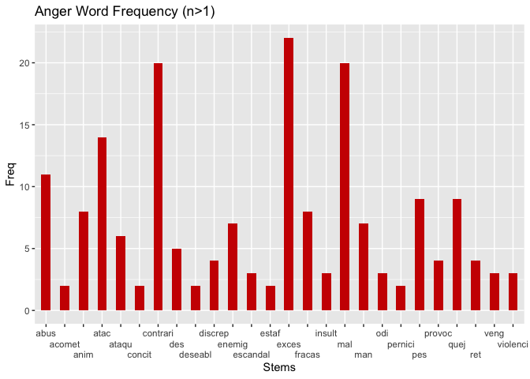
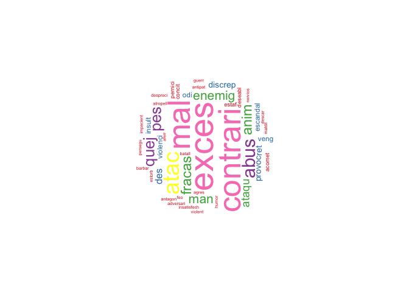
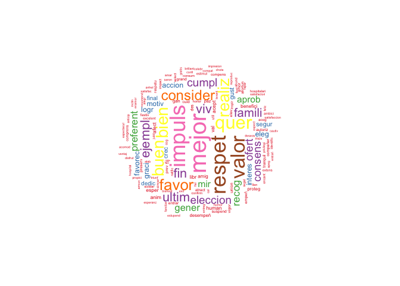
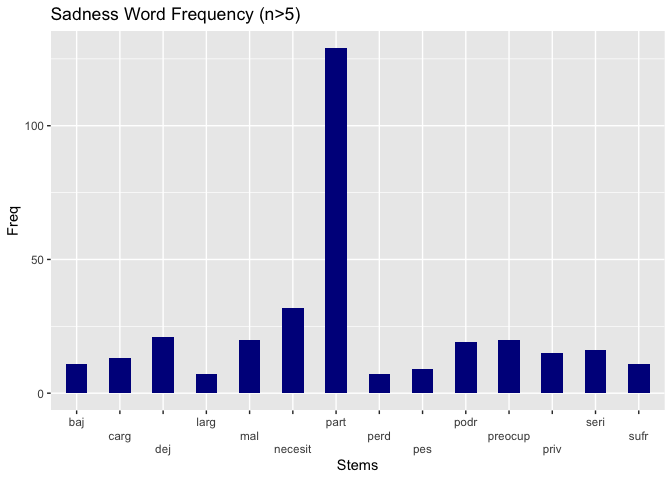
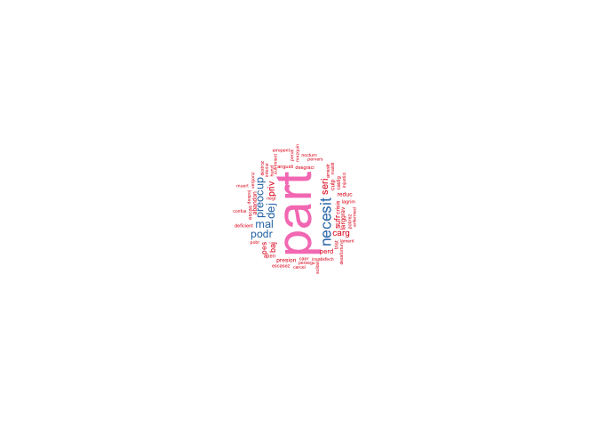
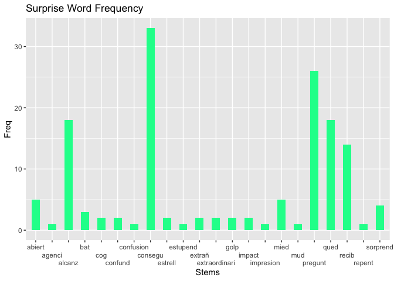
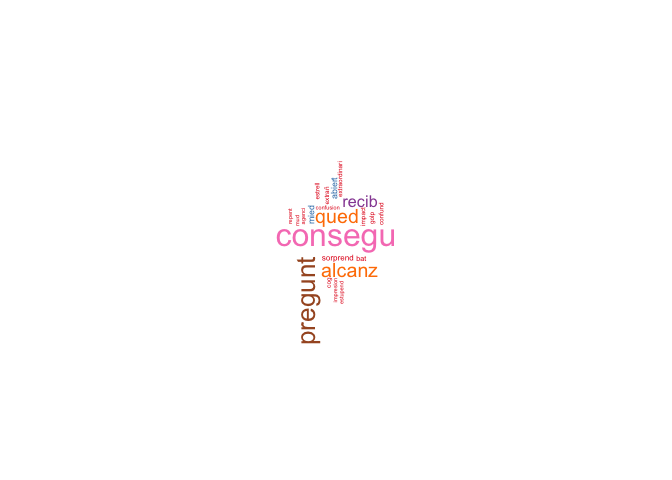
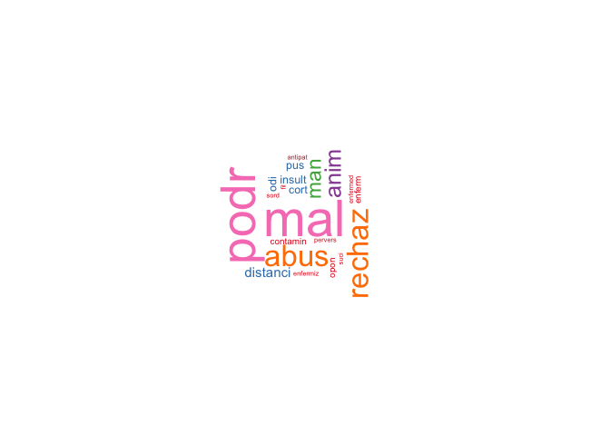
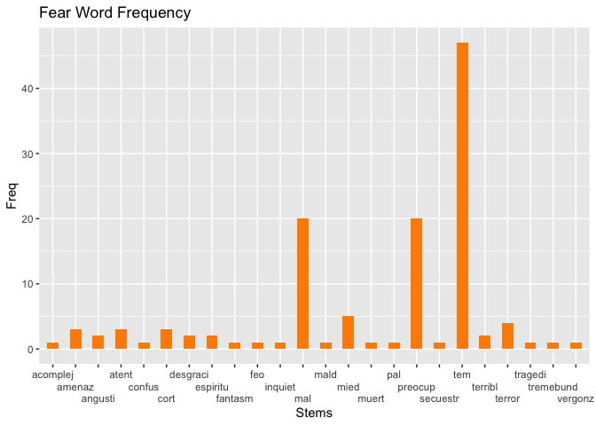
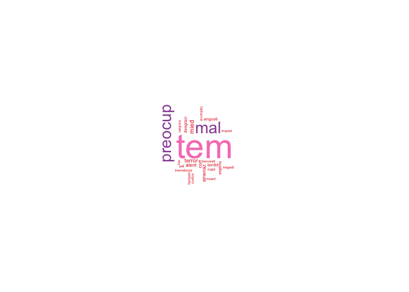

# An Emotional Landscape of Euskara: Final Report

## Background

The Basque language (Euskara) is one that has a very rich history, and, despite numerous attempts at eradication (Zuazo, 1996), continues to be spoken by a total of around 900,000 people in the Basque Country, which is located around the Pyrenees mountains in Spain and France (Etxepare Euskal Institutua, 2024). These attempts at eradication occurred in the 18th and 19th centuries, as well as during the dictatorship of Francisco Franco. Though it occupies only a small region of the world, it is divided into several even smaller provinces, or Euskal Herria (Etxepare Euskal Institutua, 2024). On the Spanish side of the Basque Country to the south, the provinces are Alava, Bizkaia, Gipuzkoa, and Navarre, and on the French side to the north, the provinces are Labourd, Lower Navarre, and Soule (Etxepare Euskal Institutua, 2024). Though Basque is a language with relatively few speakers compared to that of a English, it nonetheless expresses great linguistic diversity (Etxepare Euskal Institutua, 2024).

Despite its history, many revitalizaiton efforts are still underway. After Franco's death, revitalization efforts began, including a reference grammar, a linguistic atlas, and proposals lexicon modernization (Zuazo, 1996). Futher, the government of the Spanish Basque Country launched a revitalization campaign, which involved a website through which Basque speakers are able to practice their language (Bitong, 2022).

This study is a non-machine learning approach to sentiment analysis. Sentiment analysis is typically used by companies to determin how customers feel about a particular service or product, and these sentiments are often polarized, with sentiments ranging from 'positive' to 'negative' to 'neutral'. Upon learning more about the history of the Basque language and revitalization efforts, I chose to conducta sentiment-based study on linguistic attitudes of Basque speakers toward the Basque language. These sentiments are not polarized in a typical way, but are rather dispersed across 6 different emotions.

Further, this study was inspired in part by a project conducted by Griffen (2023), which involved the usage of the Spanish Emotion Lexicon.

## Research Questions

This study was guided by 3 key research questions: (1) Which sentiments in the SEL are expressed in the speech data? (2) What is the overall sentiment distribution across all of the Parliament speech data? (3) What are the most frequently used words for each sentiment expressed in the data?

In addition to these questions, this study will also assess some basic statistics of both the Parliament speech data and the Spanish Emotion Lexicon data.

## Data: Basque Parliament Speech Corpus 1.0 and Spanish Emotion Lexicon (SEL).

The two datasets used for this study are the Basque Parliament Speech Corpus 1.0 and the Spanish Emotion Lexicon (SEL). The Basque Parliament Speech Corpus 1.0 was funded in part by the Spanish Ministry ofScience and Innovation as part of the OPENSPEECH project, and was initially intended to be used in machine learning models designed to __________. The raw data is divided into three languages: Basque (eu), Spanish (es), and bilingual (bi). Collection took place across parliament plenary sessions held between 2013 and 2022. The entire corpus consists of 1,462 hours of speech and 759,192 segments. The dataset used for this study was the training dataset, which was the largest dataset available in the corpus. The Spanish Emotion Lexicon is a lexicon consisting of 2,036 tokens/words distributed across 6 different emotions: Alegría (Happiness, n=668), Enojo (Anger, n=382), Miedo (Fear, n=211), Repulsión (Disgust, n=209), Sorpresa (Surprise, n=175), Tristeza (Sadness, n=391). One limitation of this lexicon is that some tokens overlap semantically. I adjusted this dataset to remove words that did not, in my opinion, carry great emotional weight. I identified and removed emotion words/tokens with the following stems: 'cuent|solo|sola|llev|lleg|sab|dec|dich|ped|mano'.

### Data cleaning and processing

The Basque Parliament Speech Corpus 1.0 raw data included 749,945 rows/utterances. This data was filtered to remove bilingual and Basque-only utterances/rows, which resulted in 524,942 rows/utterances remaining (225,021 row loss). Next, the data was further filtered by identifying only rows/utterances that contained one or more of the following keyword stems: ['hablante|euskera|lenguaje|idioma|lingüístic'] and none of a second set of keywords: ['castellan|galleg']. This ensured that (1), all rows/utterances are directly relevant to the topic of language in order to aid in identifying linguistic attitudes and (2) the rows/utterances are referring to Basque and not to Castillian or Galician Spanish. After keyword filtration, the remaining dataset included 3,209 rows/utterances (521,715 row loss). All 8 original columns were preserved and the data consisted of 127 unique speakers. The sentences were then tokenized and stemmed using the SnowballC package.

The Spanish Emotion Lexicon data  filtered to remove words that carried less emotional weight, which was guided by detecting and removing the following stems: 'cuent|solo|sola|llev|lleg|sab|dec|dich|ped|mano'. It was then stemmed using the SnowballC package. If a particular stem occurred multiple times in same emotion, duplicates were deleted. If a stem occurred multiple times across different emotions, duplicates were kept. After cleaning, the SEL consisted of 1,548 tokens.

Click [here](Data-Pipeline.md) for more detailed information on cleaning and processing.

## Analysis

Once the data were joined, the first step in the analysis was conducting a frequency distribution in the form of a series of bar plots and wordclouds. Each bar plot and word cloud below displays the sentiment-annotated stems that were present in the speech data. The bar plots were adjusted to show only the most frequent stems, while the wordclouds reflected all of the annotated data.

