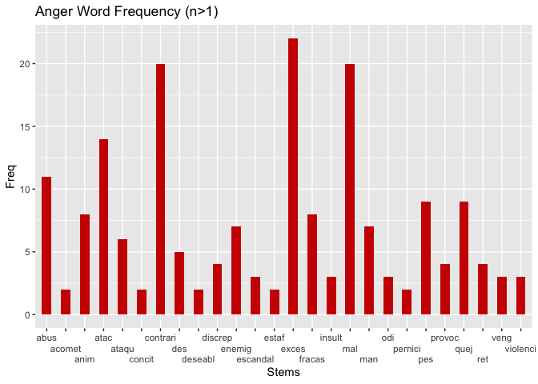
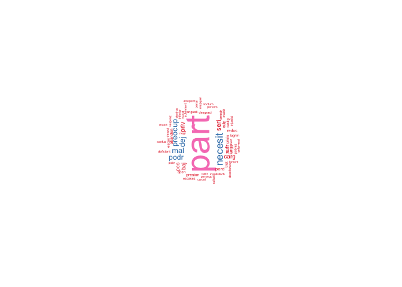
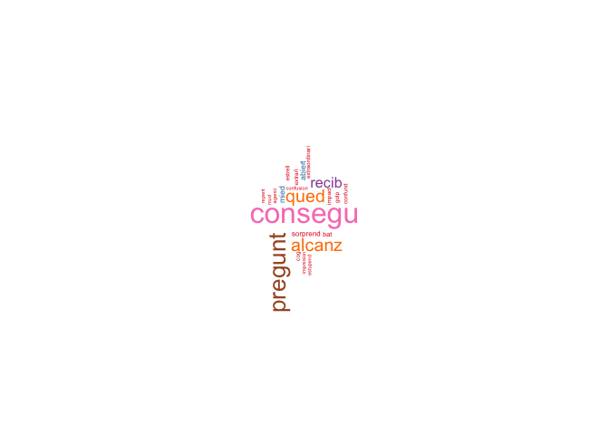
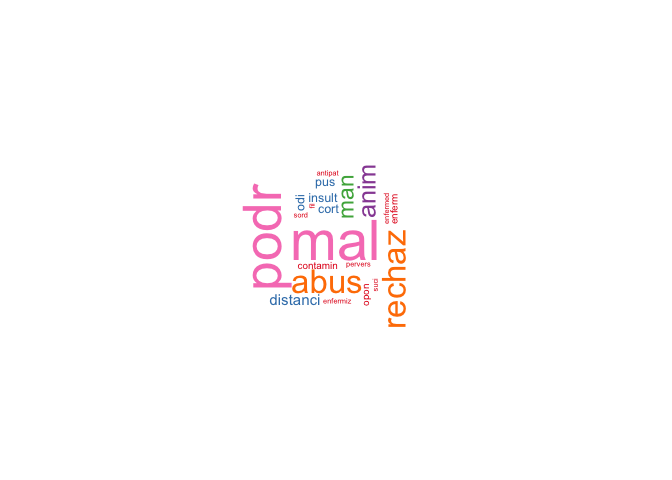

```{r setup, include=FALSE}
knitr::opts_chunk$set(echo = TRUE)
```

# An Emotional Landscape of Euskara: Final Report

## Background

The Basque language (Euskara) is one that has a very rich history, and, despite numerous attempts at eradication (Zuazo, 1996), continues to be spoken by a total of around 900,000 people in the Basque Country, which is located around the Pyrenees mountains in Spain and France ("What is the Basque language?", 2024). These attempts at eradication occurred in the 18th and 19th centuries, as well as during the dictatorship of Francisco Franco. Though it occupies only a small region of the world, it is divided into several even smaller provinces, or Euskal Herria ("What is the Basque language?", 2024). On the Spanish side of the Basque Country to the south, the provinces are Alava, Bizkaia, Gipuzkoa, and Navarre, and on the French side to the north, the provinces are Labourd, Lower Navarre, and Soule ("What is the Basque language?", 2024). Though Basque is a language with relatively few speakers compared to that of a English, it nonetheless expresses great linguistic diversity ("What is the Basque language?", 2024).

Despite its history, many revitalization efforts are still underway. After Franco's death, revitalization efforts began, including a reference grammar, a linguistic atlas, and proposals lexicon modernization (Zuazo, 1996). Further, the government of the Spanish Basque Country launched a revitalization campaign, which involved a website through which Basque speakers are able to practice their language (Bitong, 2022).

This study is a non-machine learning approach to sentiment analysis. Sentiment analysis is typically used by companies to determine how customers feel about a particular service or product, and these sentiments are often polarized, with sentiments ranging from 'positive' to 'negative' to 'neutral'. Upon learning more about the history of the Basque language and revitalization efforts, I chose to conduct a sentiment-based study on linguistic attitudes of Basque speakers toward the Basque language. These sentiments are not polarized in a typical way, but are rather dispersed across 6 different emotions.

Further, this study was inspired in part by a project conducted by Griffen (2023), which involved the usage of the Spanish Emotion Lexicon.

## Research Questions

This study was guided by 3 key research questions: (1) Which sentiments in the SEL are expressed in the speech data? (2) What is the overall sentiment distribution across all of the Parliament speech data? (3) What are the most frequently used words for each sentiment expressed in the data?

In addition to these questions, this study will also assess some basic statistics of both the Parliament speech data and the Spanish Emotion Lexicon data.

## Data: Basque Parliament Speech Corpus 1.0 and Spanish Emotion Lexicon (SEL).

The two datasets used for this study are the [Basque Parliament Speech Corpus 1.0](raw_data1.csv) (Part 1), [Basque Parliament Speech Corpus 1.0](raw_data2.csv) (Part 2), and the [Spanish Emotion Lexicon (SEL)](SEL.xlsx). The Basque Parliament Speech Corpus 1.0 was funded in part by the Spanish Ministry ofScience and Innovation as part of the OPENSPEECH project, and was initially intended to be used in machine learning models designed for automated speech recognition. The raw data is divided into three languages: Basque (eu), Spanish (es), and bilingual (bi). Collection took place across parliament plenary sessions held between 2013 and 2022. The entire corpus consists of 1,462 hours of speech and 759,192 segments. The dataset used for this study was the training dataset, which was the largest dataset available in the corpus. The Spanish Emotion Lexicon is a lexicon consisting of 2,036 tokens/words distributed across 6 different emotions: Alegría (Happiness, n=668), Enojo (Anger, n=382), Miedo (Fear, n=211), Repulsión (Disgust, n=209), Sorpresa (Surprise, n=175), Tristeza (Sadness, n=391). One limitation of this lexicon is that some tokens overlap semantically. I adjusted this dataset to remove words that did not, in my opinion, carry great emotional weight. I identified and removed emotion words/tokens with the following stems: 'cuent', 'solo', 'sola', 'llev', 'lleg', 'sab', 'dec', 'dich', 'ped', 'mano'.

### Data cleaning and processing

The Basque Parliament Speech Corpus 1.0 raw data included 749,945 rows/utterances. This data was filtered to remove bilingual and Basque-only utterances/rows, which resulted in 524,942 rows/utterances remaining (225,021 row loss). Next, the data was further filtered by identifying only rows/utterances that contained one or more of the following keyword stems: 'hablante', 'euskera', 'lenguaje', 'idioma', 'lingüístic' and none of a second set of keywords: 'castellan', 'galleg'. This ensured that (1), all rows/utterances are directly relevant to the topic of language in order to aid in identifying linguistic attitudes and (2) the rows/utterances are referring to Basque and not to Castillian or Galician Spanish. After keyword filtration, the remaining dataset included 3,209 rows/utterances (521,715 row loss). All 8 original columns were preserved and the data consisted of 127 unique speakers. The sentences were then tokenized and stemmed using the SnowballC package.

The Spanish Emotion Lexicon data  filtered to remove words that carried less emotional weight, which was guided by detecting and removing the following stems: 'cuent', 'solo', 'sola', 'llev', 'lleg', 'sab', 'dec', 'dich', 'ped', 'mano'. It was then stemmed using the SnowballC package. If a particular stem occurred multiple times in same emotion, duplicates were deleted. If a stem occurred multiple times across different emotions, duplicates were kept. After cleaning, the SEL consisted of 1,548 tokens.

Click [here](Data-Pipeline.md) for more detailed information on cleaning and processing.

## Analysis

Once the data were joined, the first step in the analysis was conducting a frequency distribution in the form of a series of bar plots and wordclouds. Each bar plot and word cloud below displays the sentiment-annotated stems that were present in the speech data. The bar plots were adjusted to show only the most frequent stems, while the wordclouds reflected all of the annotated data. All visuals were created with ggplot, wordcloud, RColorBrewer, waffle, knitr, and kableExtra.

### Anger Plots



### Happiness Plots


### Sadness Plots



### Surprise Plots



### Disgust Plots



### Fear Plots


As shown in the above plots the most common stems in the speech data associated with each sentiment are as follows: Anger: 'exces', Happiness: 'mejor', Sadness: 'part', Surprise: 'consegu', Disgust: 'mal', Fear: 'tem'.

An additional component of the study is to demonstrate the composition of general sentiments across speakers. In total, the data consists of 111 unique speakers. The most frequent emotion expressed by each speaker was calculated. As some speakers presented utterances that were associated with more than one sentiment at an equal frequency, these additional sentiments were also taken into consideration. 128 sentiments were distributed across the 111 unique speakers. The below waffle plot can be pictured as physical parliament session, each member represented by one (or more) squares.

### Sentiment Per Speaker Across Speech Data


### Sentiment Per Speaker Across Speech Data Proportions


## Additional Distributions and Proportions

In order to produce a meaningful analysis, the above sentiment distribution must be compared with (1) the sentiment distribution across the entire SEL as some sentiment categories contained more sentiment tokens than others and (2) the sentiment distribution across an additional reference set--specifically one that is based on a keyword set that is not language-oriented. For the below analysis, the keyword stem used was 'econom' to isolate utterances that are related to economy. The pipeline to construct the economy reference set distribution is the same as the pipeline used to construct the Basque language set. Both the general SEL sentiment distribution and the economy reference distribution will assist in analyzing the most prevalent emotions in Basque language-related speech.

### Sentiment Distribution Across All SEL Data


### Sentiment Proportion Across All SEL Data


### Economy Reference Set Sentiment Distribution


### Economy Reference Set Sentiment Proportions


As shown by the figures above, there is a substantial difference between the Sentiment Per Speaker Across Speech Data Proportions and the Sentiment Proportion Across All SEL Data. When subtracting the two matrices (specifically Speech Data from SEL Data), the following differences appear:

### Proportion Differences between Speech Data and SEL Data:
Happiness: -0.43552164
Anger:      0.14763001
Fear:       0.08056767
Disgust:    0.09161014
Surprise:   0.05143734
Sadness:    0.06427649

As shown, the proportion of Happiness is larger in the Speech Data than it is in the SEL Data by around 43.6%. The proportions are smaller in the Speech Data than the SEL Data in every other category. The comparison between these distribution matrices suggests that the Basque speakers generally experience the sentiment of Happiness more than any other sentiment category, and this finding does not simply result from a higher number of Happiness-related words in the SEL. The other sentiments of Anger, Fear, Disgust, Surprise, and Sadness are all lower in the Speech Data than in the SEL data, with none having a percentage difference of 15% or above.

Further, the Speech Data proportion findings can also be compared to a sample reference set: the Economy Reference Set. Because the sentiment of Fear was not present in the Economy set, the distribution difference for Fear will not be calculated. Below are the proportion differences that result from subtracting the Speech Data proportions from the SEL Data proportions:

### Proportion Differences Between Speech Data and Economy Reference Set Data:
Happiness: -0.0013393
Anger:     -0.0176339
Disgust:    0.0129464
Surprise:  -0.0169643
Sadness:    0.0464286

As demonstrated above, when comparing proportion differences Between Speech Data and Economy Reference Set Data, it is revealed that the proportions of sentiments in each data set vary only slightly, with no category equaling or surpassing a difference of 5%. These findings once again suggest that, when approaching the analysis using a ~1 sentiment-per-individual model, Basque Parliament speakers generally express the sentiment of Happiness more than any other emotion, even when compared to the SEL Data set and the Economy Reference Data set.

## Reflections on Data Processing

Overall, both the Basque Parliament Speech Corpus 1.0 and the Spanish Emotion Lexicon were incredibly easy datasets to work with. They were both tidy and easy to interpret and understand. However, this study presented several challenges, especially in the realm of data processing and analysis of distributions. First, due to many overlapping sentiment words (literally and semantically) and words that carried 'low emotional weight' in the SEL, it was necessary to stem them and filter out some words that would not result in a productive data analysis. The first time I conducted and presented this analysis, the words were not stemmed, which resulted in multiple occurrences of words with the same stem, as well as some words that did not carry enough emotional weight for interpretation. However, once the datasets were prepared, the analysis portion was relatively straightforward. In terms of the distribution analysis, it was slightly difficult to assess how exactly to compare dataset-to-dataset in a way that benefitted the study. Ultimately, by the courteous suggestion by Dr. Dan Villareal (University of Pittsburgh), the Economy Reference Set was implemented in addition to the SEL Data set to aid in comparing distributions.

## References

### The literature
Zuazo, K. (1996). The Basque Country and the Basque language. Towards a History of the Basque Language, 5. https://doi.org/10.1075/cilt.131.02zua 

What is the Basque language?. Etxepare Euskal Institutua. (2024). https://www.etxepare.eus/en/what-is-the-basque-language 

Bitong, A. (2022, February 24). The mysterious origins of europe’s oldest language. BBC. Retrieved December 5, 2024,. 

### The corpora
Grigori Sidorov, Sabino Miranda-Jiménez, Francisco Viveros-Jiménez, Alexander Gelbukh, Noé Castro-Sánchez, Francisco Velásquez, Ismael Díaz-Rangel, Sergio Suárez-Guerra, Alejandro Treviño, and Juan Gordon. Empirical Study of Opinion Mining in Spanish Tweets. LNAI 7629, 2012, pp. 1-14.

@misc {software_technologies_working_group_2024,
author       = { {Software Technologies Working Group} },
title        = { basque_parliament_1 (Revision a2fbcaf) },
year         = 2024,
url          = { https://huggingface.co/datasets/gttsehu/basque_parliament_1 },
doi          = { 10.57967/hf/2485 },
publisher    = { Hugging Face }
}

### Technical
Griffen, K. (2023, March 27). Intro to Natural Langauge Processing. RPubs. https://rpubs.com/klgriffen96/data607_hw10 
